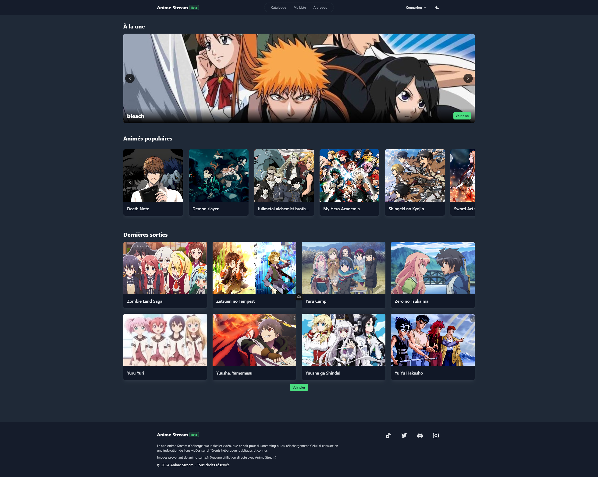
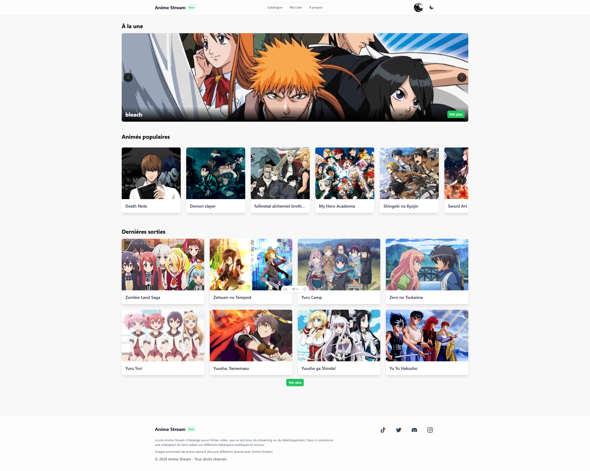
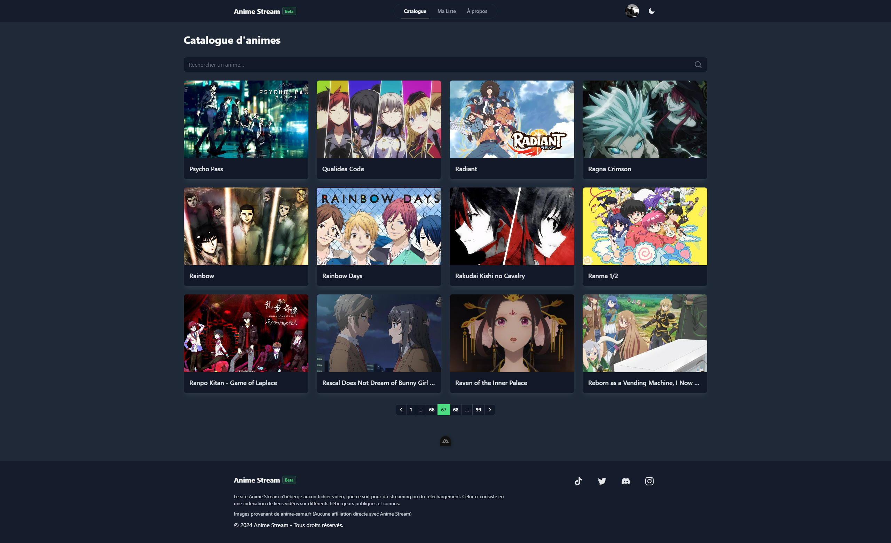
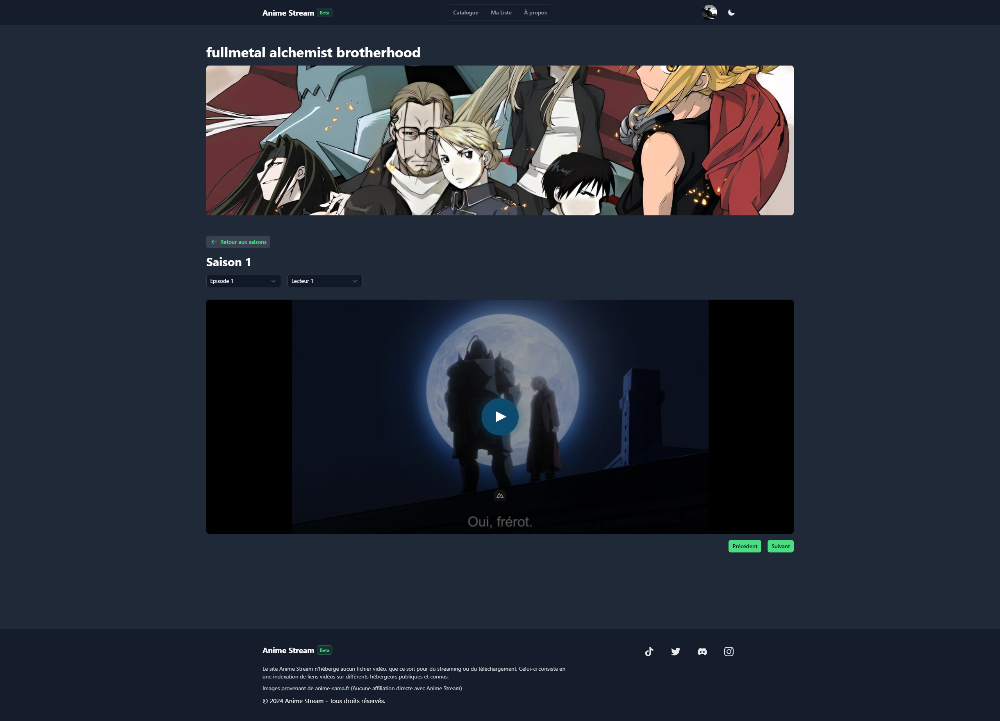
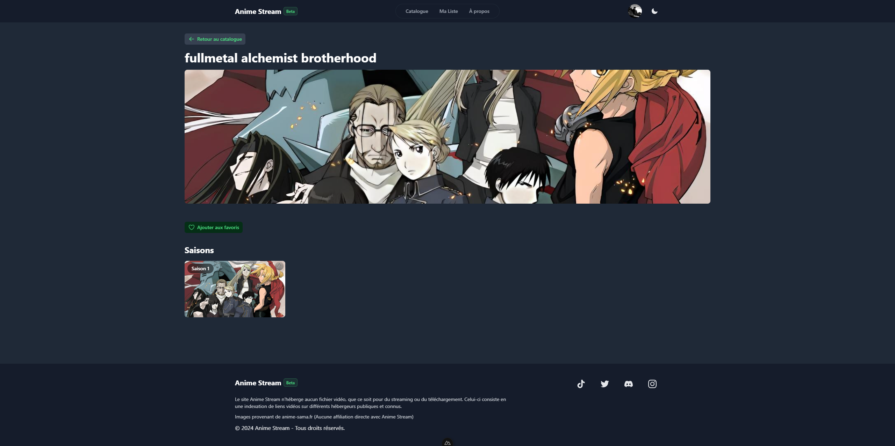
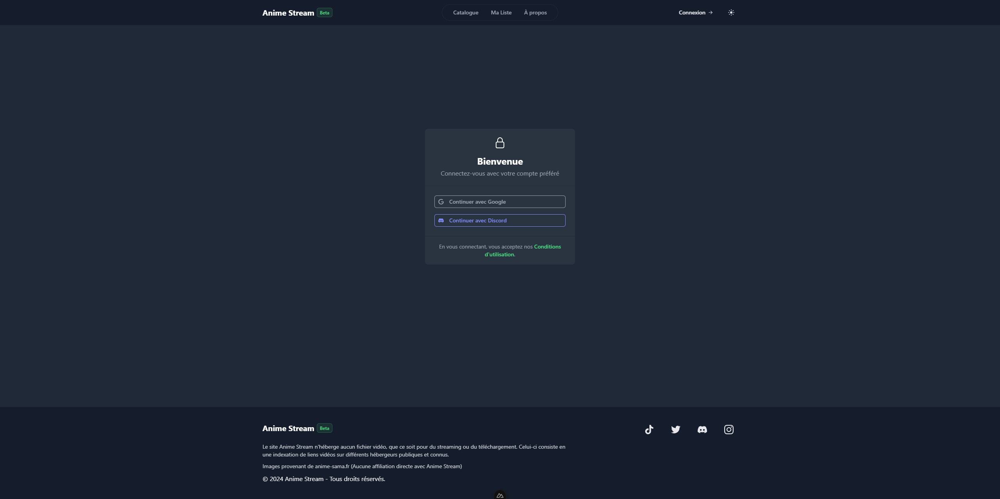

# 🎬 Anime Stream

<div align="center">
  
  
</div>

Une plateforme moderne de streaming d'anime développée avec Nuxt.js, offrant une expérience utilisateur fluide et intuitive.

## 📸 Aperçu

<div align="center">
  <div style="display: flex; justify-content: space-around; margin-bottom: 20px;">
    
    
  </div>
  <div style="display: flex; justify-content: space-around;">
    
    
  </div>
</div>

## ✨ Fonctionnalités Principales

<table style="width: 100%;">
  <tr>
    <td>
      <h3>📺 Streaming</h3>
      <ul>
        <li>Vaste bibliothèque d'animes</li>
        <li>Lecteurs multiples par épisode</li>
        <li>Mises à jour quotidiennes</li>
        <li>Interface épurée</li>
      </ul>
    </td>
    <td>
      <h3>👤 Authentification</h3>
      <ul>
        <li>Création de compte</li>
        <li>Connexion sécurisée</li>
        <li>Sessions persistantes</li>
      </ul>
    </td>
  </tr>
  <tr>
    <td>
      <h3>📋 Profil Utilisateur</h3>
      <ul>
        <li>Système de favoris</li>
        <li>Historique de visionnage</li>
        <li>Reprise de lecture</li>
        <li>Suivi des animes</li>
      </ul>
    </td>
    <td>
      <h3>🎨 Interface</h3>
      <ul>
        <li>Design moderne</li>
        <li>Navigation intuitive</li>
        <li>Mode sombre/clair</li>
        <li>100% responsive</li>
      </ul>
    </td>
  </tr>
</table>

## 🛠 Stack Technique

### Frontend


### Backend


### Bot


## 🚀 Installation

1. **Cloner le repository**

```bash
git clone https://github.com/Zakaria-salmi/anime-stream
```

2. **Installation du bot**

```bash
cd anime_bot
npm install
```

3. **Installation du frontend**

```bash
cd anime_stream
npm install
```

4. **Configuration des variables d'environnement**

```bash
Dans le dossier anime_stream
cp .env.example .env
```

5. **Lancer le développement**

```bash
npm run dev
```

## ⚙️ Configuration Supabase

1. Créer un projet sur [Supabase](https://supabase.com)
2. Configurer les tables suivantes :
    - `animes`
    - `episodes`
    - `users`
    - `favorites`
    - `viewing_history`
3. Ajouter les variables d'environnement :

```env
SUPABASE_URL=votre_url_supabase
SUPABASE_KEY=votre_clé_supabase
```

## 💡 Contribution

Les contributions sont les bienvenues ! Suivez ces étapes :

1. Fork le projet
2. Créez votre branche (`git checkout -b feature/AmazingFeature`)
3. Committez vos changements (`git commit -m 'Add some AmazingFeature'`)
4. Push sur la branche (`git push origin feature/AmazingFeature`)
5. Ouvrez une Pull Request

## 🤝 Contact

Lien du projet: [https://github.com/Zakaria-salmi/anime-stream](https://github.com/Zakaria-salmi/anime-stream)

---

<p align="center">Développé avec ❤️ par Salmi Zakaria</p>
